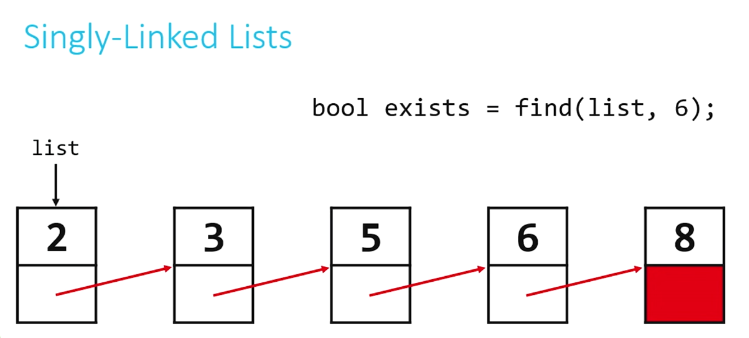
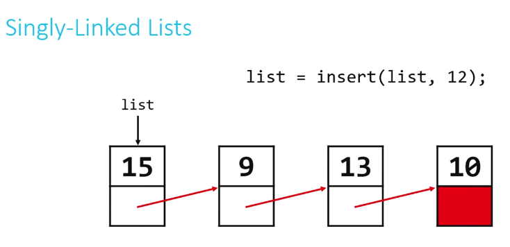
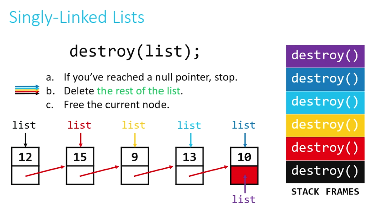
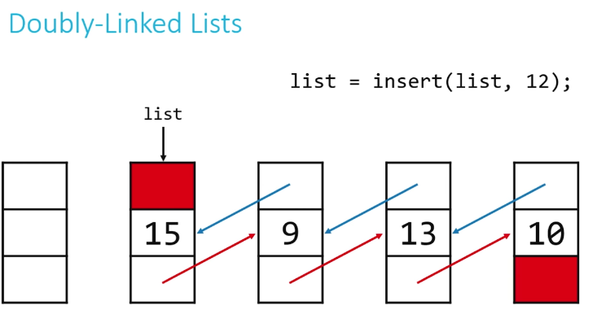
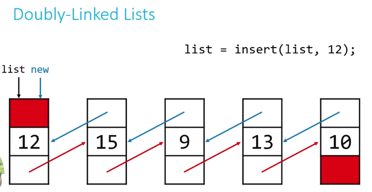
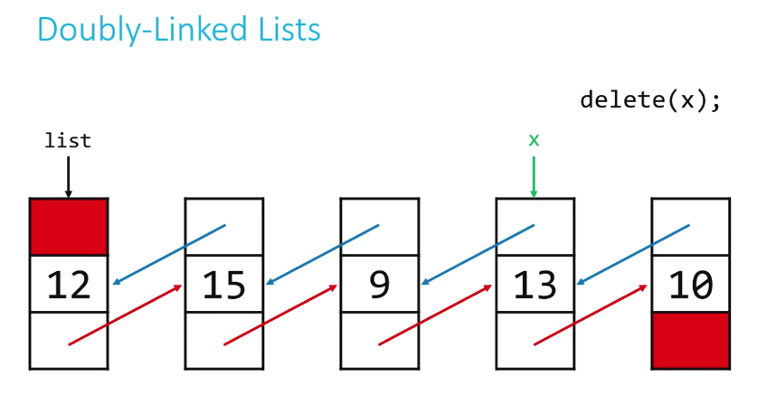
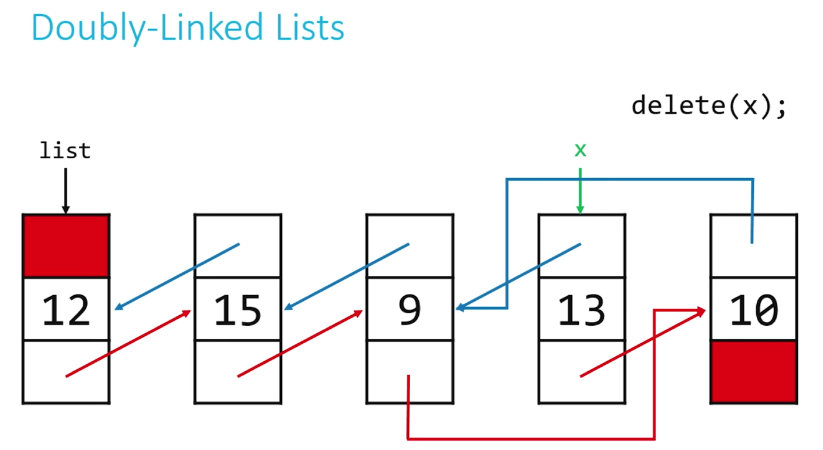
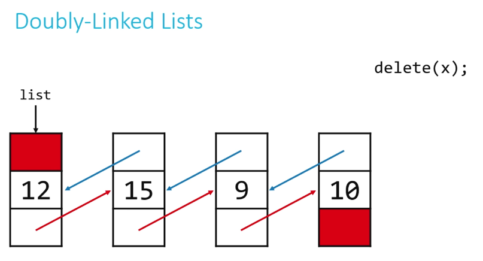

# CS50 - Week 5
## [Data Structures](https://cs50.harvard.edu/x/2023/shorts/data_structures/)

### Arrays
- Insertion - Bad
- Deletion - Bad
- Lookup - Great
- Relatively easy to sort
- Relatively small
- Fixed size, no flexibilty

### Linked Lists
- Insertion - Easy
- Deletion - Easy
- Lookup - Bad
- Relatively difficult to sort
- Relatively small

### Hash tables
- Insertion - Two-steps: hash, then add
- Deletion - Easy, once element is found
- Lookup - Generally better then linked lists because of benefit of constant factor
- Not ideal for sorting, use array instead
- Size varies greatly

### Tries
- Insertion - Complex because of dynamic memory allocation, but gets easier
- Deletion - Easy, just free a node
- Lookup - Fast, almost as fast as an array
- Generally already sorted
- Becomes huge in size very fast
<br>
<br>

## [Structures](https://cs50.harvard.edu/x/2023/shorts/structures/)
- Structures allow us to put several variables of different types into a single new type that can have it's own name.
- They use `struct` in C to create this "super-variable"

```c
struct my_struct
{
    int number;
    char initial_letter;
}
my_struct;
```
- They can be defined at the start of the program after the imports, but they're more tipically defined in separate .h files and then imported to the main file.
- fields, or members, of the struct are accessed with the dot (.) operator.
```c
//declaration of the variable
my_struct a; 
//assigning 10 to the variable "a" number field
a.number = 10; 
//assigning 10 to the variable "a" initial_letter field
a.initial_letter = 'b';
```
- They can be dynamically allocated on the heap at run time. In this case we need to dereference the pointer to the structure to access its fields.
```c
//declaration
struct my_struct *a = malloc(sizeof(struct my_struct));

// accessing fields
a -> number = 10;
a -> initial_letter = 'b';
```
<br>
<br>

## [Singly-Linked Lists](https://cs50.harvard.edu/x/2023/shorts/singly_linked_lists/)

- Arrays are inflexible. Singly-linked lists allow for adding and removing items without wasting space and much more efficiently than arrays
- A node is a struct that has some type of data and a pointer to another node of the same type, forming a chain that can be followed from the beginning to the end of the structure
```c
//must be declared like this with a temporary name at the top of the file
typedef struct my_linked_list
{
    int number; //data
    struct my_linked_list* next; //pointer to another node of the same type
}
my_node; //afterwards it can be used with only the actual name of the struct
```
- Operations with linked lists:
    1. Create linked list when it doesn't already exist
    2. Search through a linked list for an element 
    3. Insert new node
    4. Delete single element
    5. Delete entire linked list

1. **Create a linked list**
```c
//function
my_node* create(VALUE val) //VALUE = type, val = parameter
a. Dynamically allocate space for new node (malloc)
b. Make sure we didn't run out of memory (check if it points to null, which means out of memory)
c. initialize node's val field (my_node.val = argument)
d. initialize node's next field (my_node.next = NULL)
e. return a pointer to the newly created sllnode (return node that was created)
```

2. **Search for an element**

**IMPORTANT** - Always keep track of the first element of the list, maybe even put it in a global variable
```c
//function
bool find(my_node* head, VALUE val) //head = first element
a. Create a traversal (duplicate of first pointer) pointer pointing to the list's head, no need to malloc because the node already exists 
b. If current node's val field is the value we're looking for, return true
c. If false, set traversal pointer to the next pointer and repeat step b. (trav* = trav.next)
d. If you've reached the end (NULL), return false
```


3. **Insert new node**

**IMPORTANT** - Always keep track of the first element of the list, maybe even put it in a global variable
```c
my_node* insert(my_node* head, VALUE val)
a. Dynamically allocate space for new node (malloc)
b. Make sure we didn't run out of memory (check if it points to null, which means out of memory)
c. Insert new node at the beginning of the linked list
d. Return pointer to the new head of the linked list
```

**IMPORTANT** - Make sure to set the new node's next pointer to the old head of the list, then set the head of the list to the new node

4. **Delete single element**

It will be addressed in doubly-linked lists.

5. **Delete entire linked list**
```
void destroy(my_node* head)
a. If you've reached null pointer, stop (base case)
b. Delete the rest of the list (recursion)
c. Free the current node
```

<br>
<br>

## [Doubly-Linked Lists](https://cs50.harvard.edu/x/2023/shorts/doubly_linked_lists/#doubly-linked-lists)
- Doubly-linked lists, unlike singly-linked lists, allow us to move forward and backward through the list by adding an extra pointer pointing to the previous node, making it easier to delete a single element in the list
```c
typedef struc dllist
{
    VALUE val;
    struct dllist* prev;
    struct dllist* next;
}
dllnode;
```
- Almost all the operations available for singly-linked lists are implementend pretty much the same way in doubly-linked lists. The exceptions are:

    3. Insert new node
    4. Delete single element

3. **Insert new node**
```c
dllnode* insert(dllnode* head, VALUE val)
a. Dynamically allocate space for new node (malloc)
b. Make sure we didn't run out of memory (check if it points to null, which means out of memory)
c. Insert new node at the beginning of the linked list, make next pointer of the new value point to the old head of the list, and make it's previous pointer NULL
d. (Extra step) Fix the previous pointer of the old head of the list so it points to the new head, make the new node the new head of the list
e. Return pointer to the new head of the linked list
```



4. **Delete single element**
```c
void delete(dllnode* target)
a. Fix the pointers of the sorrounding nodes to "skip over" target
b. Free target
```




### Benefits and downsides of linked lists
- Insertion and deletion can be done in constant time O(1)
- We lose indexing, so we can't access a node randomly. Accessing a node may take linear time O(n)
 > Linked lists are particularly useful when frequent insertions and deletions are required, while arrays are more suitable for scenarios that require random access to elements.

 #### Links
 [Linked Lists - Computerphile](https://youtu.be/_jQhALI4ujg)
<br>
<br>

## [Hash Tables](https://cs50.harvard.edu/x/2023/shorts/hash_tables/)
- Hash tables combine the random access ability of arrays with the dynamism of linked lists
- If implemented correctly almost all operations can start to tend toward constant time
- Bad at ordering or sorting data
- Hash tables are the combinations of a **hash function**, which returns a nonnegative integer value colled a _hash code_, and an **array** capable of storing data of the type we wish to place into the data structure
- The idea is to run our data though the hash function and store the data in the element of the array represented by the returned hash code
- How to write a good hash function:
    - Use only and all the data being hashed
    - Be deterministic - always return the same hash code for the same value being passed
    - Uniformly distribute data
    - Generate very different hash codes for very similar data

```c
unsigned int hash(char* str)
{
    int sum = 0;
    for (int j = 0; str[j] != '/0'; j++) 
    {
        //adds ASCII values of the characters in the string to sum
        sum += str[j];
    }
    return sum % HASH_MAX;
}
```
- There's a lot of good hash functions on the internet

### Collision
- Occurs when two pieces of data return the same hash code
- In order not to overwrite the previous data, we want to store both pieces of data
- We need a way to keep both elements in the hash table, and still preserve quick insertion and lookup

### Chaining
- Every element of the array is a linked list
- If a value has a hash code that's already taken, it's stored in the linked list corresponding to that hash code
