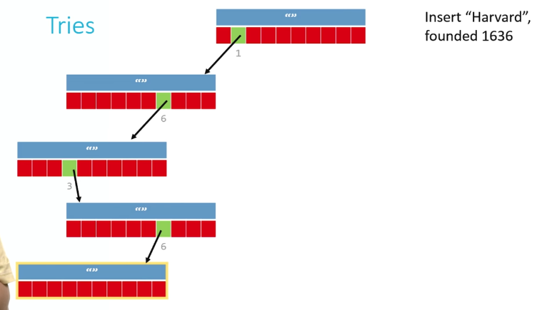
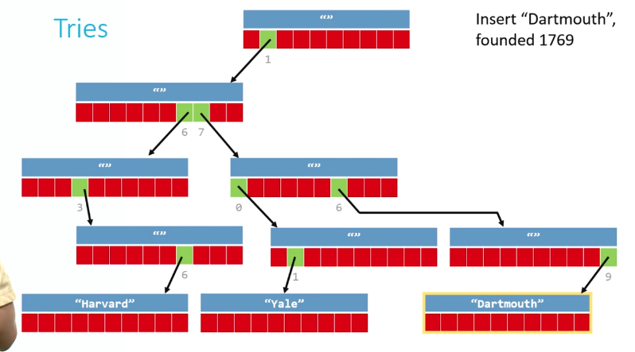

# CS50 - Week 5
## [Data Structures](https://cs50.harvard.edu/x/2023/shorts/data_structures/)

### Arrays
- Insertion - Bad
- Deletion - Bad
- Lookup - Great
- Relatively easy to sort
- Relatively small
- Fixed size, no flexibilty

### Linked Lists
- Insertion - Easy
- Deletion - Easy
- Lookup - Bad
- Relatively difficult to sort
- Relatively small

### Hash tables
- Insertion - Two-steps: hash, then add
- Deletion - Easy, once element is found
- Lookup - Generally better then linked lists because of benefit of constant factor
- Not ideal for sorting, use array instead
- Size varies greatly

### Tries
- Insertion - Complex because of dynamic memory allocation, but gets easier
- Deletion - Easy, just free a node
- Lookup - Fast, almost as fast as an array
- Generally already sorted
- Becomes huge in size very fast
<br>
<br>
## [Structures](https://cs50.harvard.edu/x/2023/shorts/structures/)
- Structures allow us to put several variables of different types into a single new type that can have it's own name.
- They use `struct` in C to create this "super-variable"

```c
struct my_struct
{
    int number;
    char initial_letter;
}
my_struct;
```
- They can be defined at the start of the program after the imports, but they're more tipically defined in separate .h files and then imported to the main file.
- fields, or members, of the struct are accessed with the dot (.) operator.
```c
//declaration of the variable
my_struct a; 
//assigning 10 to the variable "a" number field
a.number = 10; 
//assigning 10 to the variable "a" initial_letter field
a.initial_letter = 'b';
```
- They can be dynamically allocated on the heap at run time. In this case we need to dereference the pointer to the structure to access its fields.
```c
//declaration
struct my_struct *a = malloc(sizeof(struct my_struct));

// accessing fields
a -> number = 10;
a -> initial_letter = 'b';
```
***
## [Singly-Linked Lists](https://cs50.harvard.edu/x/2023/shorts/singly_linked_lists/)

- Arrays are inflexible. Singly-linked lists allow for adding and removing items without wasting space and much more efficiently than arrays
- A node is a struct that has some type of data and a pointer to another node of the same type, forming a chain that can be followed from the beginning to the end of the structure
```c
//must be declared like this with a temporary name at the top of the file
typedef struct my_linked_list
{
    int number; //data
    struct my_linked_list* next; //pointer to another node of the same type
}
my_node; //afterwards it can be used with only the actual name of the struct
```
- Operations with linked lists:
    1. Create linked list when it doesn't already exist
    2. Search through a linked list for an element 
    3. Insert new node
    4. Delete single element
    5. Delete entire linked list

1. **Create a linked list**
```c
//function
my_node* create(VALUE val) //VALUE = type, val = parameter
a. Dynamically allocate space for new node (malloc)
b. Make sure we didn't run out of memory (check if it points to null, which means out of memory)
c. initialize node's val field (my_node.val = argument)
d. initialize node's next field (my_node.next = NULL)
e. return a pointer to the newly created sllnode (return node that was created)
```

2. **Search for an element**

**IMPORTANT** - Always keep track of the first element of the list, maybe even put it in a global variable
```c
//function
bool find(my_node* head, VALUE val) //head = first element
a. Create a traversal (duplicate of first pointer) pointer pointing to the list's head, no need to malloc because the node already exists 
b. If current node's val field is the value we're looking for, return true
c. If false, set traversal pointer to the next pointer and repeat step b. (trav* = trav.next)
d. If you've reached the end (NULL), return false
```


3. **Insert new node**

**IMPORTANT** - Always keep track of the first element of the list, maybe even put it in a global variable
```c
my_node* insert(my_node* head, VALUE val)
a. Dynamically allocate space for new node (malloc)
b. Make sure we didn't run out of memory (check if it points to null, which means out of memory)
c. Insert new node at the beginning of the linked list
d. Return pointer to the new head of the linked list
```

**IMPORTANT** - Make sure to set the new node's next pointer to the old head of the list, then set the head of the list to the new node

4. **Delete single element**

It will be addressed in doubly-linked lists.

5. **Delete entire linked list**
```
void destroy(my_node* head)
a. If you've reached null pointer, stop (base case)
b. Delete the rest of the list (recursion)
c. Free the current node
```


**Example**

```c
#include <stdio.h>
#include <cs50.h>
#include <stdlib.h>

typedef struct node
{
    string phrase;
    struct node *next;
}
node;

#define LIST_SIZE 2

void unload(node *list);
void visualize(node *list);

int main(void)
{
    node *list = NULL; //create list, currently empty

    for (int i = 0; i < LIST_SIZE; i++)
    {
        string phrase = get_string("Enter a new phrase: ");

        node *n = malloc(sizeof(node)); //alloc memory for node
        if (n == NULL) //check for null
        {
            printf("Couldn't allocate memory\n");
        }
        n->phrase = phrase; //set the new node phrase attribute to be whatever the user input was
        n->next = list; //set the next attribute to point to where list pointer is poining at
        //IT'S IMPORTANT TO FOLLOW THIS ORDER OF OPERATION, OTHERWISE WE LOSE THE NODE WE JUST CREATED AND GET A SEGMENTATION FAULT
        list = n; //set the head of the list to the current node. the last node created will be the head
        visualize(list);
    }

    unload(list);

}

void unload(node *list)
{
    while (list != NULL)
    {
        node *ptr = list->next; //create a new pointer to point to the second node on the list, if we free the first node directly we lose the rest of the nodes
        free(list); //free the memory for the current head of the node
        list = ptr; //make list point to where ptr is currently pointing to
        //repeat until list points to null, which means the list is empty
    }
}

void visualize(node *list)
{
    printf("\n+-- List Visualizer --+\n\n");
    while (list != NULL)
    {
        printf("Location %p\n", list); //print out the address of the head of the list
        printf("Phrase: \"%s\"\n", list->phrase); //print out the phrase and then the next atributes
        printf("Next: %p\n\n", list->next); // the next attribute is the address of the next node
        list = list->next; //set list no point to the next node
        //repeat until list points to null
    }
    printf("--------------------\n");
}
```
***
## [Doubly-Linked Lists](https://cs50.harvard.edu/x/2023/shorts/doubly_linked_lists/#doubly-linked-lists)
- Doubly-linked lists, unlike singly-linked lists, allow us to move forward and backward through the list by adding an extra pointer pointing to the previous node, making it easier to delete a single element in the list
```c
typedef struc dllist
{
    VALUE val;
    struct dllist* prev;
    struct dllist* next;
}
dllnode;
```
- Almost all the operations available for singly-linked lists are implementend pretty much the same way in doubly-linked lists. The exceptions are:

    3. Insert new node
    4. Delete single element

3. **Insert new node**
```c
dllnode* insert(dllnode* head, VALUE val)
a. Dynamically allocate space for new node (malloc)
b. Make sure we didn't run out of memory (check if it points to null, which means out of memory)
c. Insert new node at the beginning of the linked list, make next pointer of the new value point to the old head of the list, and make it's previous pointer NULL
d. (Extra step) Fix the previous pointer of the old head of the list so it points to the new head, make the new node the new head of the list
e. Return pointer to the new head of the linked list
```


4. **Delete single element**
```c
void delete(dllnode* target)
a. Fix the pointers of the sorrounding nodes to "skip over" target
b. Free target
```


### Benefits and downsides of linked lists
- Insertion and deletion can be done in constant time O(1)
- We lose indexing, so we can't access a node randomly. Accessing a node may take linear time O(n)
 > Linked lists are particularly useful when frequent insertions and deletions are required, while arrays are more suitable for scenarios that require random access to elements.

 #### Links
 [Linked Lists - Computerphile](https://youtu.be/_jQhALI4ujg)

 [Understanding and implementing a Linked List in C and Java
](https://www.youtube.com/watch?v=VOpjAHCee7c)
***

## [Hash Tables](https://cs50.harvard.edu/x/2023/shorts/hash_tables/)
- Hash tables combine the random access ability of arrays with the dynamism of linked lists
- If implemented correctly almost all operations can start to tend toward constant time
- Bad at ordering or sorting data
- Hash tables are the combinations of a **hash function**, which returns a nonnegative integer value colled a _hash code_, and an **array** capable of storing data of the type we wish to place into the data structure
- The idea is to run our data though the hash function and store the data in the element of the array represented by the returned hash code
- How to write a good hash function:
    - Use only and all the data being hashed
    - Be deterministic - always return the same hash code for the same value being passed
    - Uniformly distribute data
    - Generate very different hash codes for very similar data

```c
unsigned int hash(char* str)
{
    int sum = 0;
    for (int j = 0; str[j] != '/0'; j++) 
    {
        //adds ASCII values of the characters in the string to sum
        sum += str[j];
    }
    return sum % HASH_MAX;
}
```
- There's a lot of good hash functions on the internet

### Collision
- Occurs when two pieces of data return the same hash code
- In order not to overwrite the previous data, we want to store both pieces of data
- We need a way to keep both elements in the hash table, and still preserve quick insertion and lookup

### Chaining
- Every element of the array is a linked list
- If a value has a hash code that's already taken, it's stored in the linked list corresponding to that hash code

### Links
[Understanding and implementing a Hash Table (in C)](https://www.youtube.com/watch?v=2Ti5yvumFTU)

**Example - Hash function**
```c
#include <stdio.h>
#include <stdlib.h>
#include <string.h>
#include <cs50.h>
#include <ctype.h>

typedef struct node
{
    string phrase;
    struct node *next;
}
node;

node *table[26];

int hash(string phrase);

int main(void)
{
    for (int i = 0; i < 3; i++)
    {
        string phrase = get_string("Enter a new phrase: ");
        int index = hash(phrase);
        printf("%s hashes to %i\n", phrase, index);
    }
}

int hash(string phrase)
{
    //generates hash code that represents the index of the array the user input is going to be stored in
    return toupper(phrase[0]) - 'A'; //take the first letter of the phrase, generalize it to upper case, then subtract 'A' to get an index number consistent with the letter in the alphabet
}

//good hash functions:
//- always gives the same value for the same input
//- produces an even distribution across buckets
//- uses all buckets
```

***

## [Tries](https://cs50.harvard.edu/x/2023/shorts/tries/)
- Tries combine structures and pointers to store data
- The data is like a roadmap, if you reach the end, that means the data exists in the trie, if not, it doesn't
- Unlike hash tables, there are no collisions. Every piece of data has a unique path, unless they are identical
```c
typedef struct _trie
{
    char university[20];
    struct _trie* paths[10]; //array of pointers to each possible digit of a year, from 0 to 9
}
trie;
```
**Example:**

### Insertion
Year: 1636 (key) 

University: Harvard (value)

- Create a global variable to store the root of the trie, and create a temporary variable that is a copy of the root to traverse through the trie
- We have to insert Harvard in the key 1636
- We first look at the 10 digits in the array of paths and go down the path of the first digit, which is 1
- Repeat this process for the other digits, 6, 3, and then 6
- We store the value "Harvard" in the node after the last digit





### Search
- Create traversal pointer (copy of root)
- From the root go down digit by digit of the year, starting from 1
- If 1 is in the node, go down the structure following the next digits
- If there are no more digits to go down, we compare what's stored in the next node to the data we're looking for, if it is we succeeded
- If we can't reach the end of the structure because the node with one of the digits of the year is NULL, that means what we're looking is not there


### Links
[The Trie Data Structure (Prefix Tree)](https://www.youtube.com/watch?v=3CbFFVHQrk4)

[The Trie Data Structure (search, delete)](https://www.youtube.com/watch?v=NDfAYZCHstI&pp=ygULdHJpZXMgaW4gYyA%3D)
***

## [Queues](https://cs50.harvard.edu/x/2023/shorts/queues/)

- A queue is a _first in, first out (FIFO)_ data structure
- Can be implemented using arrays or linked lists
- Operations avaiable are:
    - Enqueue: add new element to the end of the queue
    - Dequeue: remove oldest element from the front of the queue


**Using Arrays**
```c
typedef struct _queue
{
    VALUE array[CAPACITY]; //maximum capacity of the queue
    int front; //index of the array that has the oldest element  
    int size; //current size of the queue
}
queue;
```
```c
queue q;
q.front = 0;
q.size = 0;
```
- enqueue()
    - Accept a pointer to the queue
    - Accept data of type VALUE (any type, value is generic) to be added to the queue
    - Add data to que end of the queue
    - Change size of the queue

```c
void enqueue(queue* q, VALUE data);
```
```c
enqueue(&q, 28);
```

```c
enqueue(&q, 33);
```


- dequeue()
    - Accept a pointer to the queue
    - Change location of the front of the queue
    - Decrease the size of the queue
    - Return value that was removed from the queue
    
```c
void dequeue(queue* q);
```
```c
dequeue(&q);
```


**Using doubly-linked lists**
```c
typedef struct _queue
{
    VALUE val;
    struct _queue *prev;
    struct _queue *next;
}
queue;
```

**IMPORTANT** - Always keep pointers to the head and the tail of the linked list

- enqueue()
    - Dinamically allocate new node
    - Set its next pointer to NULL, and its previous pointer to the current tail
    - Set the current tail's next pointer to the new node;
    - Move tail pointer to the newly-created node


- dequeue()
    - Traverse linked list to the second element (if it exists)
    - Free head of the list
    - Move head pointer to the new head (previous second element)
    - Make this node's previous pointer point to NULL


***

## [Stacks](https://cs50.harvard.edu/x/2023/shorts/stacks/)

- Like queues, stacks can be implemented with arrays or linked lists
- A stack is a _last in, first out (LIFO)_ data structure
- Operations:
    - push - add new element to the top of the stack
    - pop - remove element from the top of the stack

**Using arrays**
```c
typedef struct _stack
{
    VALUE array[CAPACITY];
    int top;
}
```

- push()
    - Accept pointer to the stack
    - Accept data to be added
    - Add data to the top of the stack
    - Change top of the stack to the next index in the array

```c
void push(stack* s, VALUE data)
```
```c
stack s;
s.top = 0;
push(&s, 28); //will put 28 at the end of the array / top of the stack
```

- pop()
    - Accept a pointer to the stack
    - Change the location of the top of the stack ( - 1)
    - Return value that was removed

```c
VALUE pop(stack* s)
```
```c
int x = pop(&s); //will save the last element in the stack / top of the stack, and set the top field of the stack to -1, if we need to push a new element it will be overwritten
```

**Using singly-linked lists**
```c
typedef struct _stack
{
    VALUE val;
    struct _stack *next;
}
stack;
```

**IMPORTANT** - Always keep pointer to the head of the linked list

- push()
    - Dinamically allocate new node (always check for NULL)

    

    - Set the new node next pointer to point to the current head of the list

    

    - Move head pointer to the new node

    


- pop()
    - Traverse to the second element of the list (trav = trav.next)

    

    - Free the head of the list

    

    - Move the head pointer to the (former) second element
    
    
